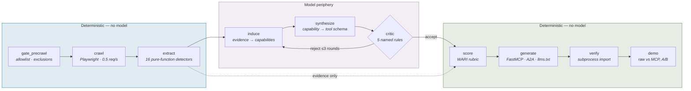

<div align="center">


# Wasl AI

**Scores whether a business is legible to AI agents, then generates the MCP server that makes it legible.**

[](#verification)
[](#evaluation)
[](#zero-paid-api-keys)
[](services/api)
[](apps/web)
[](LICENSE)

**[Live site](https://wasl-ai-eight.vercel.app)** · **[Crawler policy](https://wasl-ai-eight.vercel.app/crawler)**

*Wasl (وصل) — Arabic for connection.*

<sub>The deployed site is the interface only. The scan pipeline needs headless Chromium, Postgres,
Redis and long-lived SSE — the wrong shape for a serverless host — so it runs locally. Everything
works offline against saved fixtures with no API key of any kind.</sub>

</div>

---

## The problem

Dubai has publicly mandated agentic AI adoption across its private sector within two years, and the
UAE has directed that **50% of federal government services be delivered by autonomous agents by
2028**. Businesses are being told to "become agentic" while their websites remain completely
invisible to agents.

Wasl measures that gap, with evidence.

Paste a URL. Wasl crawls it politely, scores its agent-readiness on a published 100-point index
across six axes, and emits a runnable MCP server built only from capabilities it can actually
evidence in the site's markup.

---

## The design rule everything follows

> **Deterministic logic is code. Language models do retrieval, decomposition and explanation only.**

The model never emits a score. Scoring is a pure function over extracted evidence, living in a
package that **cannot import the model layer** — and that is verified three ways in CI, not asserted
in a README:

| Check | How |
|---|---|
| **Static** | The import graph of `wasl.scoring` is walked with `ast`. Reaching `wasl.llm`, `litellm`, `langchain` or any provider SDK fails the build. |
| **Structural** | `ScoringInput` has no field for capabilities, tool schemas or explanations. The rubric cannot read model output even by accident. |
| **Behavioural** | Injecting a fabricated *"the model asserts this site has an OpenAPI spec"* row into the evidence store does not move the score by a single point. |

What the model *does* do is propose candidate capabilities from DOM evidence. Every proposal must
cite the evidence that justifies it — enforced by a Pydantic validator, not a prompt:

```python
@field_validator("evidence_ids")
@classmethod
def must_be_grounded(cls, value: list[str]) -> list[str]:
    if not value:
        raise ValueError("A capability without evidence is not a capability.")
    return value
```

An uncited capability cannot be *constructed*. Not "is rejected later" — cannot exist.

---

## Evaluation

Every number below is written by `wasl.eval.run`. None was typed by hand.

<!-- EVAL_TABLE_START -->
_Golden set: 30 sites (0 hand-labelled) · model `ollama/qwen2.5:7b` · run 2026-07-25._

| Metric | Class | Result | Target | Status |
|---|---|---:|---:|---|
| Citation validity | gate | `1.000` | `==1` | ✅ PASS |
| Hallucinated-capability rate | gate | `0.000` | `==0` | ✅ PASS |
| State-changing tools emitted | gate | `0.000` | `==0` | ✅ PASS |
| Generated server import rate | gate | `1.000` | `==1` | ✅ PASS |
| Capability precision | tuning | `—` | `>=0.9` | ⏸ BLOCKED |
| Capability recall | tuning | `—` | `>=0.7` | ⏸ BLOCKED |
| Band accuracy (exact) | tuning | `—` | `>=0.7` | ⏸ BLOCKED |
| Band accuracy (±1 band) | tuning | `—` | `—` | ⏸ BLOCKED |
| Injection detection recall | tuning | `1.000` | `>=0.9` | ✅ PASS |
| Score stability (max delta) | operating | `0.0` | `<=4` | ✅ PASS |
| Latency p95 | operating | `62.6` | `<=90` | ✅ PASS |
| Cost per scan | operating | `0.00` | `==0` | ✅ PASS |

**Blocked metrics are not estimated.** `capability_precision`, `capability_recall`, `band_accuracy_exact`, `band_accuracy_within_1` require hand-labelled ground truth in `seeds/golden/labels.yaml`. The system must never generate its own labels — that would make the evaluation circular and every number above meaningless.

> Scans run against saved HTML fixtures, not live sites: the crawler refuses to start until WASL_CRAWLER_INFO_URL and WASL_OPT_OUT_EMAIL point at a live page and a real mailbox. Every model call, validator and critic rule is the production one; only the network is skipped.

<!-- EVAL_TABLE_END -->

Metrics are split into three classes and treated differently. **A gate at 0.98 is a build failure;
a tuning metric at 0.73 against a 0.70 target is a good day.** Conflating them is the most common
evaluation mistake there is. A `BLOCKED` gate is explicitly *not* a passing gate.

`uv run python -m wasl.eval.run` exits non-zero if any gate fails, so it belongs in CI.

---

## Architecture



The dotted line is the important one: **the scoring node reads evidence, never model output.**

| Layer | Contains | Tested by |
|---|---|---|
| Deterministic core | Rubric, 27 checks, detectors, validators | Unit tests — 100% of decision paths |
| Model periphery | Induce, synthesize, critic | Eval suite against a golden set |
| Orchestration | LangGraph topology, state, gates, checkpoints | Integration tests + traces |
| Evidence spine | Content-addressed evidence, threaded end to end | Referential-integrity gate at 1.00 |

---

## The WARI index

100 points across six axes. Every check is a pure function returning
`(points_awarded, max_points, evidence_refs, confidence)`.

| Axis | Points | Measures |
|---|---:|---|
| 1 · Machine-Readable Identity | 15 | `robots.txt`, AI-agent stanzas, sitemap, `llms.txt`, canonicals |
| 2 · Structured Data Coverage | 20 | schema.org entity coverage and validity |
| 3 · Capability Exposure | 25 | OpenAPI specs, `.well-known` manifests, stable discovery URLs |
| 4 · Content Extractability | 15 | server-rendered vs hydration-only, semantics, pagination |
| 5 · Transactional Integrity | 15 | stable identifiers, structured pricing, labelled forms |
| 6 · Agent Governance & Safety | 10 | agent-aware terms, rate-limit headers, injection surface |

**Bands** · `0–24 Invisible` · `25–44 Emerging` · `45–64 Readable` · `65–84 Agent-Ready` · `85–100 Agent-Native`

### Three rules that are easy to get backwards

**A `robots.txt` disallow does not lower your score.** Axis 1 measures whether a site made a *legible
decision* about agent access. `User-agent: GPTBot / Disallow: /` scores identically to allowing it —
both are clear. Silence scores nothing. You are never penalised for telling agents to go away.

**A check has three outcomes, not two.** Pass, fail, or **unevaluable**. A degraded capture cannot
measure the pre-JS/post-JS delta, so that check leaves both the numerator *and the denominator* —
the score becomes `67/97`, not `67/100`. "We could not look" and "we looked and found nothing" are
different claims and must not produce the same number.

**Thin evidence suppresses the headline, not the number.** Fewer than 8 pages crawled, or more than
30% robots-blocked, and the grade band is withheld while the score still shows. A confident-looking
band on two pages of evidence is an assertion the evidence does not support.

---

## What it refuses to do

A system that shows what it declined is more credible than one that shows only successes. Wasl
publishes its refusals as a first-class part of the report.

The critic applies **five named rules**, four of which are deterministic and run *before* any model
call:

| Rule | Deterministic? | Rejects |
|---|:---:|---|
| `no_evidence` | ✅ | Cites an evidence ID that does not exist |
| `state_changing` | ✅ | Verb or name implies book / buy / cancel / submit / pay |
| `unbounded_param` | ✅ | Tool schema has a free-text field with no description or length bound |
| `injection_detected` | ✅ | Cited evidence is itself an injection payload |
| `evidence_mismatch` | — | Cited evidence does not support the claim *(the only genuinely semantic one)* |

State-change detection runs against the verb and name **independently of the model's own flag** — a
model that wants its tool emitted has an incentive to mark it read-only. And when the critic itself
is unreachable, capabilities are **dropped**, never passed through: a critic that fails open defeats
its own purpose.

---

## Zero paid API keys

Model routing is LiteLLM over **Groq → Gemini → Cerebras → Ollama**. The last link is the point:
with no keys configured at all, every call routes to a local model and the entire pipeline still
runs end to end. A demo that needs someone else's quota is not a demo you can rely on.

Cost per scan is `$0.00` by construction, and reported as a measured constraint rather than an
estimate.

---

## Crawler ethics

Wasl reads the open web. That is a privilege, and the rules are enforced in code rather than left to
good intentions — the rate limit and page caps are **module constants, not settings**, so no caller,
config file or environment variable can raise them.

| | |
|---|---|
| **Method** | `GET` only. No POST, PUT, PATCH, DELETE. |
| **Rate** | 0.5 req/s per domain, as an atomic Redis reservation shared across workers |
| **Volume** | 12 pages interactive, 40 batch. Never more. |
| **robots.txt** | Authoritative. A disallow is recorded as *evidence*, never routed around. |
| **Identity** | Honest User-Agent pointing at a live policy page. **The crawler refuses to start without one.** |
| **Opt-out** | Honoured within 24h. The exclusion registry is checked *before* the allowlist. |
| **Rate limits** | Read passively from headers. Nothing probes for a 429. |
| **Published results** | Government entities anonymised. Anyone removed on request. |

Full policy: [`docs/crawler-policy.md`](docs/crawler-policy.md) · the live page ships at `/crawler`.

### Prompt injection

Crawled content is adversarial input, and Wasl's output is a public score — which gives an attacker
a concrete motive. Every byte reaching a model goes through **one chokepoint**, with a per-call nonce
so a page cannot forge the closing delimiter. A CI test walks the AST for `.complete()` call sites
and fails any module that issues one without importing the wrapper.

Wrapping is the mitigation; the scanner is the **measurement**. Injection-detection recall is a
number in the table above, stratified across nine pattern categories.

---

## Quick start

Requires Docker, [`uv`](https://docs.astral.sh/uv/), [`pnpm`](https://pnpm.io/), and
[Ollama](https://ollama.com) if you want to run with no API keys at all.

```bash
git clone https://github.com/krish2105/Wasl-AI-.git && cd Wasl-AI-
cp .env.example .env
docker compose up -d                    # postgres + pgvector, redis
```

```bash
cd services/api
uv sync && uv run playwright install chromium
uv run alembic upgrade head
uv run uvicorn wasl.main:app --reload    # :8000
```

```bash
cd apps/web && pnpm install && pnpm dev   # :3000
```

Traces are optional and heavy — bring Langfuse up only when you want them:

```bash
docker compose --profile obs up -d        # Langfuse v3 on :3001
```

### Try it without a network

The crawler will not run until `WASL_CRAWLER_INFO_URL` and `WASL_OPT_OUT_EMAIL` are set. Everything
else works against saved fixtures — the full pipeline, every validator, every critic rule:

```bash
uv run python -m wasl.scoring.cli --fixture rich_site        # six-axis table
uv run python -m wasl.graph.cli --fixture rich_site          # capabilities + refusals
uv run python -m wasl.generators.cli --fixture rich_site     # generate + verify a server
uv run python -m wasl.eval.run                               # the metrics table
```

---

## Project structure

```
wasl-ai/
├── apps/web/                    Next.js 14 · App Router · light + dark
│   ├── app/                     hero · /scan · /scan/[jobId] · /crawler · /leaderboard
│   ├── components/              score · demo · graph · scan · ui
│   └── lib/                     zod-validated API client
├── services/api/
│   └── wasl/
│       ├── crawler/             policy · robots · ratelimit · fetch · 16 detectors
│       ├── scoring/             THE RUBRIC — imports nothing from llm/
│       ├── graph/               LangGraph state · nodes · runner · SSE events
│       ├── llm/                 router · untrusted-content chokepoint · versioned prompts
│       ├── generators/          FastMCP emitter · A2A card · llms.txt · ship gate
│       ├── eval/                metrics · runner · README auto-write
│       └── security/            injection scanner (9 pattern categories)
├── seeds/                       101 seed URLs · 30-site golden set scaffold
├── docs/                        crawler policy
└── scripts/                     verify_seeds · fetch_reference_corpora
```

~13k lines of Python, ~2.8k of TypeScript, **414 tests**.

---

## Verification

```bash
cd services/api && uv run pytest          # 414 passed
uv run alembic check                      # no model/schema drift
uv run python -m wasl.eval.run            # exits non-zero on any gate failure
cd apps/web && pnpm typecheck && pnpm build
```

---

## Limitations

Stated before anyone else finds them.

**Four metrics are unmeasured.** Capability precision, recall and band accuracy need 30 hand-labelled
sites; the labels do not exist yet. They report `BLOCKED`, never an estimate.

**Scans currently run against fixtures, not live sites.** The crawler refuses to start without a
configured identity — a User-Agent advertising a URL nobody can read is dishonest identification.
That refusal is deliberate and tested.

**The latency figure excludes live-crawl throttle.** A cold interactive crawl adds ~44s (12 pages
plus 10 site probes at 0.5 req/s) before any model work.

**Score stability is measured at its deterministic floor.** Against fixtures it is exactly 0, because
the rubric is a pure function. That tests reproducibility of the scoring code, not variance from a
live crawl finding different pages on different days.

**Injection recall is measured against payloads written alongside the patterns that catch them.** It
validates that the scanner searches the right hiding places, not that it generalises to payloads
nobody anticipated.

**The split-screen demo's MCP arm fails on the offline model tier.** Asked to read a product out of
tool results, `qwen2.5:7b` returns a fluent, plausible, entirely invented answer. The demo detects
this — every claimed value is checked against the material the arm was shown, and an untraceable
answer counts as a failure — so the panel reports the fabrication rather than rendering it as a win.
A Groq or Gemini key is expected to clear it.

**"Required property" is Wasl's definition, not schema.org's.** schema.org defines none; taken
literally, Axis 2's validity check is unfalsifiable. The operational definition lives in
[`schema_required.yaml`](services/api/wasl/scoring/schema_required.yaml) with its reasoning — and it
deliberately does *not* require `postalCode`, which would systematically penalise correct UAE
addresses.

**Text-in-image is a proxy.** No OCR. Axis 4 measures content-imagery-to-text ratio and alt coverage.

**About a fifth of the seed list blocks automated clients**, including six of the thirty golden
sites. Those scans will be thin and their bands correctly suppressed — which means the golden set's
effective size is under 30 for some metrics.

---

## Status

| Phase | | |
|---|---|---|
| 0 | Architecture, `CLAUDE.md`, rubric design | ✅ |
| 1 | Skeleton, Docker, DB, OTel | ✅ |
| 2 | Crawler, evidence, 16 detectors | ✅ |
| 3 | Deterministic WARI rubric | ✅ |
| 4 | LangGraph pipeline, router, critic | ✅ |
| 5 | Generators + ship gate | ✅ |
| 6 | Evaluation harness | ✅ |
| 7 | Frontend, six screens, light + dark | ✅ |
| 8 | Public leaderboard | ⏸ needs live crawls |

---

## Licence and scope

MIT. A research and portfolio project.

Generated Agent Cards are **unsigned and illustrative** — they do not represent registered production
agents, and were not published by the sites they describe. Nothing here constitutes legal advice
about crawling. No real citizen, customer or employee data is used anywhere in this repository.
