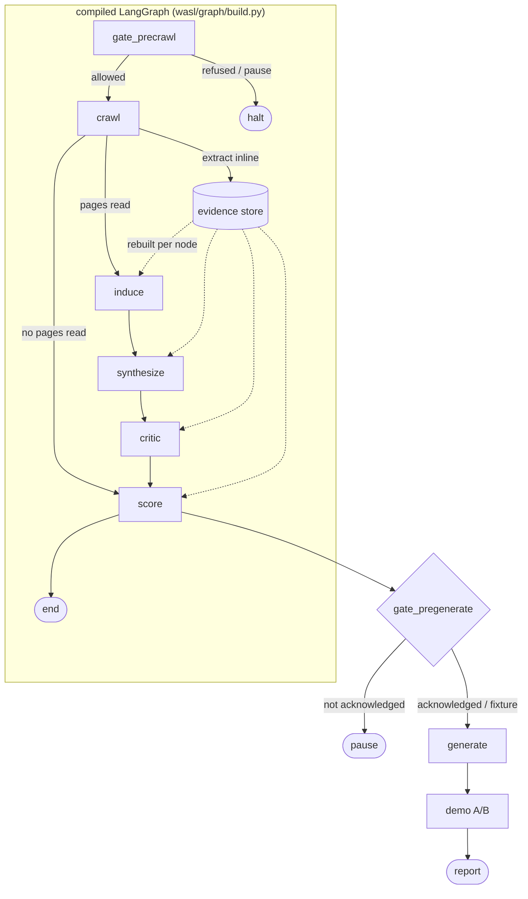

# Architecture

Wasl AI scores whether a public website is legible to an AI agent, then generates
the MCP server that would make it legible. This document describes how it is put
together and, where it matters, why it is put together that way rather than the
obvious alternative.

For what it does *not* do well, see [limitations.md](limitations.md). That
document is not an appendix to this one; it is the other half of the claim.

---

## 1. The rule everything else follows from

> **Deterministic logic is code. Models do retrieval, decomposition and
> explanation. Nothing else.**

No model call returns a number a user acts on. Not a score, not a sub-score, not
a band, not a confidence level. Those come from pure functions over evidence.

The model's four jobs are: induce candidate capabilities from evidence,
synthesize a tool schema for a candidate, critique candidates against named
rules, and write prose that explains what the deterministic layer decided.

This is enforced structurally rather than by discipline. `wasl/scoring/` imports
nothing from `wasl/llm/`, and `tests/scoring/test_score_is_llm_independent.py`
runs a full scan with the induce, synthesize and critic nodes disabled and
asserts the score is byte-identical. A regression here is a failing build, not a
code review comment.

**Why it matters beyond correctness:** it is the difference between a system that
can be audited and one that can only be trusted. Every scored claim resolves to a
verbatim snippet of markup, and the path from that snippet to the points awarded
is a function you can read.

---

## 2. Layer map

| Layer | Contains | How it is tested |
|---|---|---|
| **Deterministic core** | `wasl/scoring/` — 6 axes, 27 checks, bands, confidence | Unit tests per check, plus counterfactual and LLM-independence tests |
| **Model periphery** | `wasl/llm/`, `wasl/graph/nodes/{induce,synthesize,critic,demo}.py` | Golden-set eval, not unit tests alone |
| **Orchestration** | `wasl/graph/` — LangGraph topology, state, gates, checkpointing | Integration tests over fixtures |
| **Evidence spine** | `wasl/crawler/evidence.py` — threaded through every layer | Referential-integrity gate at 1.00 |

Most of the interesting decisions are about keeping the first row from leaking
into the second.

---

## 3. Data flow



Everything from `gate_precrawl` through `score` runs as the compiled graph.
Generation and the demo run after it, in `wasl/graph/runner.py`.

### Why generation sits outside the graph

`generate` needs the verification outcome and `demo` needs the raw pre-JS HTML.
Neither belongs in a checkpointed state object — carrying megabytes of HTML
through every checkpoint to serve one call would defeat the point of
checkpointing. The demo re-reads its HTML from the snapshot cache instead, so
nothing is re-fetched.

`gate_pregenerate` therefore is not a graph node. It runs at the generation
boundary, which is the point it actually guards.

---

## 4. Evidence

Every `Capability`, `ToolSchema` and sub-score carries `evidence_ids: list[str]`,
non-empty, enforced by a Pydantic `field_validator` that raises on an empty list.
An uncited claim is not rejected downstream — it is unconstructable.

Evidence IDs are content-addressed:

```
sha256(source_url | kind | selector | raw)[:16]
```

Two consequences fall out of that choice. Deduplication is free: the same
evidence found twice yields the same ID. And a citation recorded before a
checkpoint still resolves after it, which would not be true of any counter-based
scheme.

Evidence stores the **verbatim snippet**, never a paraphrase. If the exact text a
claim rests on cannot be shown to the user, the claim does not have evidence.

Referential integrity is a hard gate: `citation_validity == 1.00`. Every
`evidence_id` referenced anywhere must resolve to a real row.

---

## 5. Scoring

Six axes, 100 points, 27 checks. Every check is a pure function of the evidence
store: no I/O, no model calls, no globals.

| # | Axis | Points |
|---|---|---:|
| 1 | Machine-Readable Identity | 15 |
| 2 | Structured Data Coverage | 20 |
| 3 | Capability Exposure | 25 |
| 4 | Content Extractability | 15 |
| 5 | Transactional Integrity | 15 |
| 6 | Agent Governance & Safety | 10 |

`wasl/scoring/rubric.py` raises `AssertionError` if any axis stops summing to its
declared maximum, or if the six stop summing to 100. A rubric that silently
drifts is worse than one that fails loudly.

### Bands

`Invisible` 0–24 · `Emerging` 25–44 · `Readable` 45–64 · `Agent-Ready` 65–84 ·
`Agent-Native` 85–100.

The percentage is rounded before banding so the displayed number and the band
always agree.

### Three outcomes per check, not two

A check can pass, fail, or be **unevaluable**. An unevaluable check leaves both
the numerator *and the denominator* — it is not scored zero.

This matters when Playwright is unavailable and the pre-JS/post-JS delta cannot
be measured. Scoring that check zero would make every degraded scan look worse
than the site deserves, and the score would stop meaning what the rubric says it
means. Instead the check is suppressed, `max_possible` drops, and the report is
badged `DEGRADED` with the reason stated.

### Confidence suppression

Fewer than 8 pages read, or more than 30% robots-blocked, and the report shows
`LOW CONFIDENCE` with the **band suppressed entirely**. The numeric score is still
shown; the grade is not. A confident-looking grade on thin evidence is worse than
no grade.

---

## 6. Crawling

The limits are module constants in `wasl/crawler/policy.py`, deliberately not
settings, so no caller and no environment variable can raise them:

```python
REQUESTS_PER_SECOND    = 0.5
INTERACTIVE_PAGE_CAP   = 12    # user-submitted scans
BATCH_PAGE_CAP         = 40    # leaderboard
MAX_PARSEABLE_BYTES    = 3_000_000
```

Other rules, in short: the exclusion registry is checked **before** the
allowlist and cannot be overridden by a user submission. `robots.txt` is
authoritative, and a disallow is recorded as evidence — a finding, not an
obstacle. GET only; no auth, no forms, no state-changing request ever. The
User-Agent names a live page explaining what the crawler does and an opt-out
channel someone reads.

Rate-limit detection is **passive**: it reads `Retry-After` and `RateLimit-*`
headers seen during the normal polite crawl. Deliberately hammering a site to
earn a scoring signal is forbidden, which means Axis 6 scores what the site
volunteered rather than what we could provoke.

16 detectors run over each captured page. Every one is a pure function
`(CapturedPage) -> list[Evidence]`.

---

## 7. Untrusted content

Crawled text is data, never instruction. Everything reaching a model call is
wrapped:

```
<untrusted_web_content source="crawled_page" url="{url}" evidence_id="{id}">
{content}
</untrusted_web_content>
```

`wasl/llm/untrusted.py` is the single chokepoint — nothing else may build a model
input from crawled text, and a test walks the AST for `.complete()` call sites to
enforce it. Delimiters carry a per-call nonce so a page cannot forge the closing
tag.

Detected injection attempts are logged as findings under Axis 6 and **counted**.
`injection_detection_recall` is a reported metric, currently 1.000 against 11
hand-labelled payloads.

The same principle extends to the checkpoint database. LangGraph's serializer
defaults to rebuilding any type it finds, and its own documentation warns this
permits code execution if anything can write to that database. Since checkpoint
rows contain crawled content, `wasl/graph/checkpoint.py` passes an explicit
allowlist of the ten state classes instead.

---

## 8. The critic

A candidate capability is rejected if any of five named rules fires:

1. `evidence_ids` is empty, or cites an ID that does not exist
2. the cited evidence does not contain the verb or noun claimed
3. the tool schema has an unbounded free-text parameter with no description
4. the capability implies a state-changing action — v1 emits read/search tools
   only; state-changing capabilities are *reported as detected* but never emitted
5. the source evidence contains instruction-like text

Four of the five are deterministic and need no model. That is the design: a
critic whose verdicts depend entirely on a model call is a second opinion, not a
rule engine.

Maximum 3 rounds, then the capability is **dropped** — never silently downgraded
into the output. Every rejection persists with a human-readable reason and is
shown in the UI. The "what we refused to generate" panel is a feature, not a
debug view.

---

## 9. Human gates

Two, both blocking.

**`gate_precrawl`** is the graph's entry node, before any network call. It fires
when the domain is excluded, not allowlisted, or disallowed at the root by
robots. An excluded domain is refused outright; an unlisted one pauses for a
human rather than failing.

**`gate_pregenerate`** runs at the generation boundary. Scanning a third party is
allowed; generating an MCP server that purports to describe their business is
what needs a person behind it. It clears via `acknowledge_generation` on the scan
request, surfaced as a checkbox on the scan form, and passes automatically for
fixtures.

---

## 10. Checkpointing

The graph compiles with an `AsyncPostgresSaver` when Postgres is reachable.

The reason is not crash-resilience in the abstract: **re-crawling is not a local
operation.** A scan that dies at the critic and restarts from the top sends a
fresh set of requests to somebody else's server, at 0.5 req/s, for pages already
held. Verified behaviour — a run killed at the critic resumes at the critic,
retains its evidence, and crawls once in total across both attempts.

If Postgres is unreachable the saver is `None`, and the scan runs unresumably
with a WARNING. Refusing to start a scan because the *recovery* path is
unavailable would trade a rare inconvenience for a constant one.

---

## 11. Model routing

LiteLLM, in order: Groq → Google AI Studio (Gemini) → Cerebras → Ollama.

Every tier is a free tier or a local model. **Cost per scan is $0.00**, and that
is a design constraint, not an outcome — a paid key anywhere in this project is a
bug.

Ollama is the offline fallback and, in practice, what the golden run used. Its
consequences for capability induction are documented honestly in
[limitations.md](limitations.md) §1, because they are the largest weakness in the
system.

Structured outputs use schema-constrained decoding (Ollama `format`, OpenAI
`response_format`) rather than parse-and-retry. Prompts live in versioned `.md`
files under `wasl/llm/prompts/`, never as inline string literals, and each
prompt file's SHA is recorded in traces and in the eval report.

---

## 12. Observability

OpenTelemetry GenAI semantic conventions → OTLP → self-hosted Langfuse v3.
Spans cover every model call, tool execution, node transition and decision
branch, nested to preserve parent-child across the graph.

---

## 13. What is deliberately not built

Named here so the shape of the system is not mistaken for an accident:

- **Payments, x402, AP2** — out of scope for v1
- **A2A runtime** — the Agent Card is emitted; nothing serves it
- **Multi-tenant auth, billing, accounts** — a portfolio system with one operator
- **Anything that writes to a third-party website** — the reason the emitted
  tools are read/search only
- **A browser extension**

And what is planned but genuinely unfinished — the batch crawl, the leaderboard
endpoint, CI — is listed in [limitations.md](limitations.md) §7 rather than
implied to exist here.
